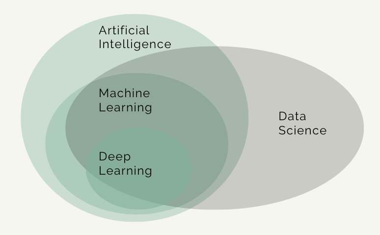

[Course Overview](index.md) > Concepts of machine learning and computer vision

# Concepts of machine learning and computer vision

In this section we will discuss some important concepts on machine learning, deep learning and computer vision.

 
 

**Data science** is a recent umbrella term (that covers several subdisciplines) that includes artificial intelligence (AI), machine learning and deep learning, but also certain aspects of computer science including algorithms, data storage, and web application development. Data science is also a practical discipline that requires understanding of the domain in which it is applied in, for example, business or science. Data science solutions often involve AI but usually not as much as most people would expect from the headlines.

**Machine learning** can be said to be a subfield of AI, while deep learning is a subfield of ML (such categories are often somewhat imprecise and for example some parts of machine learning could belong to statistics). Machine learning can be defined as a system that improve its performance in a given task with more experience or more data.

 

 

The area of machine learning is often divided in subareas according to the kinds of problems being solved. So roughly it can be divided in supervised and unsupervised learning.

In **supervised learning** the model is given an input, for example a photograph with a traffic sign, and the task is to predict the correct output or label, for example which traffic sign is in the picture (speed limit, stop sign, etc.). In the simplest cases, the answers are in the form of yes or no (binary classification problems).

In **unsupervised learning** there are no labels or correct outputs. The task is to discover the structure of the data: for example, grouping similar items to form “clusters” or reducing the data to a smaller number of important “dimensions”. So for example exploratory data visualization can be considered unsupervised learning.

Overver it is important to remember that these categories are somewhat overlapping, so a particular method can sometimes be hard to place in one category. Also, an additional category you can find in the literature is the so-called **semisupervised learning** which is partly supervised and partly unsupervised.

Each of these machine categories have different types of algorithms include classification, regression, clustering and dimensionality reduction. In this course we will focus primarily on supervised learning, and in particular, classification tasks for visual data. 

 

 

**Computer vision** is the study of building artificial systems that can process, perceive and reason about visual data, which can be images or videos.

The role of computer vision is getting more and more important in our society. And because millions of images and visual data are being generate everyday it is just impossible to look at this massive amount of data individually. We need automated systems to do this, make this process feasible and so it's very important to build algorithms that can process and reason about these data. 

 

 ## Video

_In preparation_

 

