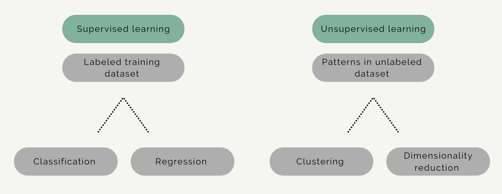
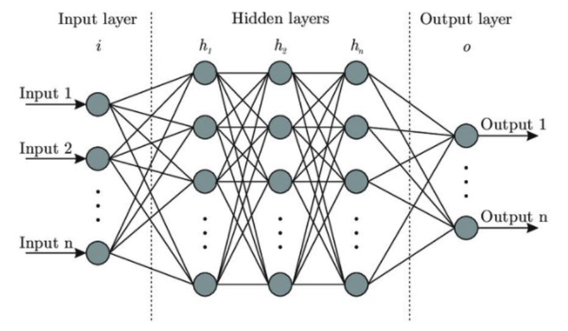

[Course Overview](index.md) > Concepts of machine learning and computer vision

# Concepts of machine learning and computer vision

In this section we will discuss some important concepts on machine learning, deep learning and computer vision.

 
 

## Data Science

 

**Data science** is a recent umbrella term (that covers several subdisciplines) that includes artificial intelligence (AI), machine learning and deep learning, but also certain aspects of computer science including algorithms, data storage, and web application development. Data science is also a practical discipline that requires understanding of the domain in which it is applied in, for example, business or science. Data science solutions often involve AI but usually not as much as most people would expect from the headlines.

 

## Machine learning

 

**Machine learning** can be said to be a subfield of AI, while deep learning is a subfield of ML (such categories are often somewhat imprecise and for example some parts of machine learning could belong to statistics). Machine learning can be defined as a system that improve its performance in a given task with more experience or more data.

 

 

The area of machine learning is often divided in subareas according to the kinds of problems being solved. So roughly it can be divided in supervised and unsupervised learning.

In **supervised learning** the model is given an input, for example a photograph with a traffic sign, and the task is to predict the correct output or label, for example which traffic sign is in the picture (speed limit, stop sign, etc.). In the simplest cases, the answers are in the form of yes or no (binary classification problems).

In **unsupervised learning** there are no labels or correct outputs. The task is to discover the structure of the data: for example, grouping similar items to form “clusters” or reducing the data to a smaller number of important “dimensions”. So for example exploratory data visualization can be considered unsupervised learning.

Overver it is important to remember that these categories are somewhat overlapping, so a particular method can sometimes be hard to place in one category. Also, an additional category you can find in the literature is the so-called **semisupervised learning** which is partly supervised and partly unsupervised.

Each of these machine categories have different types of algorithms include classification, regression, clustering and dimensionality reduction. In this course we will focus primarily on supervised learning, and in particular, classification tasks for visual data. 

 

 

**Computer vision** is the study of building artificial systems that can process, perceive and reason about visual data, which can be images or videos.

The role of computer vision is getting more and more important in our society. And because millions of images and visual data are being generated everyday it is just impossible to look at this massive amount of data individually. We need automated systems to do this and make this process feasible and so it is very important to build algorithms that can process and reason about these data. 

 

## Deep learning

 

A technique that is widely used in computer vision these days is **deep learning**.

**Deep learning** can be defined as a system that can process and reason about data using hierarchical learning algorithms, with many "layers" that are very loosely inspired by how the brain works. That is the reason why these algorithms are called neural networks, and are often represented by images such as this one, showing the architecture of the algorithm. 

_Artificial deep neural network architecture_

Deep learning was first introduced and applied to a computer vision classification task in 2012 ([this publication](chrome-extension://efaidnbmnnnibpcajpcglclefindmkaj/https://proceedings.neurips.cc/paper/2012/file/c399862d3b9d6b76c8436e924a68c45b-Paper.pdf)), when it just crushed the [ImageNet competition](https://www.image-net.org/challenges/LSVRC/index.php), an annual Visual Classification Challenge. These researchers built and applied a deep learning algorithm called AlexNet to the ImageNet dataset, and this algorithm had significantly lower error rates than other algorithms that have been applied to the dataset until that time.

A deep neural network is a single end-to-end pipeline that, on the left hand side (input layer), takes in the raw pixels of the image and predicts the classification scores or probabilities, on the right side (output layer). During the process of the training we will tune not only the final layer but all the part of the system jointly.

The input data (or input layer) is as a column vector containing all of our pixels of our input matrix. In the middle we have the hidden vectors, _h_, and on the right our final score vectors with classification scores per category.

In addition, there are weight matrices in between each of these multiple layers of our neural network. These weight matrices have information on how much each element of the previous layer influences each element of the next layer. 

Because of this dense connectivity pattern, this type of neural network is typically called a fully connected network, because the units in each layer of the network are all connected to one another. This type of structure is also sometimes called a "Multi Layer Perceptron or MLP".

 

 ## Video ?

 

## Resources

add links to text with extra info