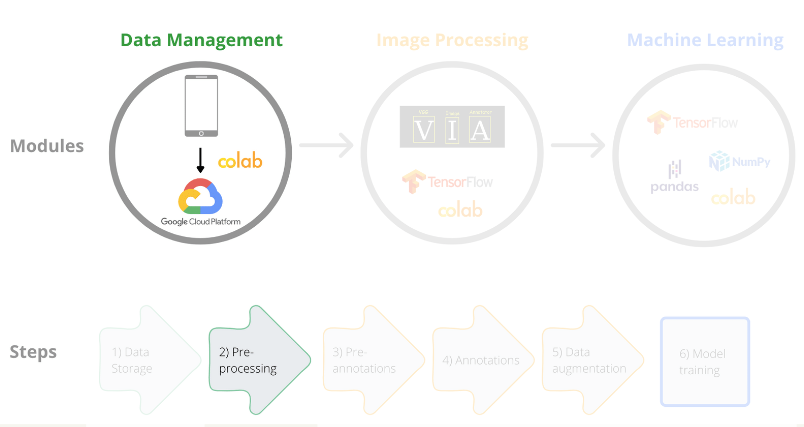

[Course Overview](index.md) \> Practice 1: Pre-processing images

# Practice 1: Pre-processing images

Framework step 2:

In this section we will pre-process images that may contain sensitive data, such as people's faces. Images collected by citizens or extracted from internet may contain sensitive data and depending on the nature of subsequent work (e.g. crowdsourced annotation of images), it may be preferable to remove such data. In this practice we will use the the Python library [CVlib](https://www.cvlib.net/) and its function `detect_face()` and the pre-trained model `caffemodel` which is available publicly and has been trained to detect human faces. After face detection, we will draw a rectangle around the face and apply an overlay to the image content inside the rectangle to hide sensitive data.

You can access the notebook here:

 

## Resources

[CVlib on Github](https://github.com/arunponnusamy/cvlib) - besides face detection the library has functions for gender detection and other objects detection (such as dog and horse)
