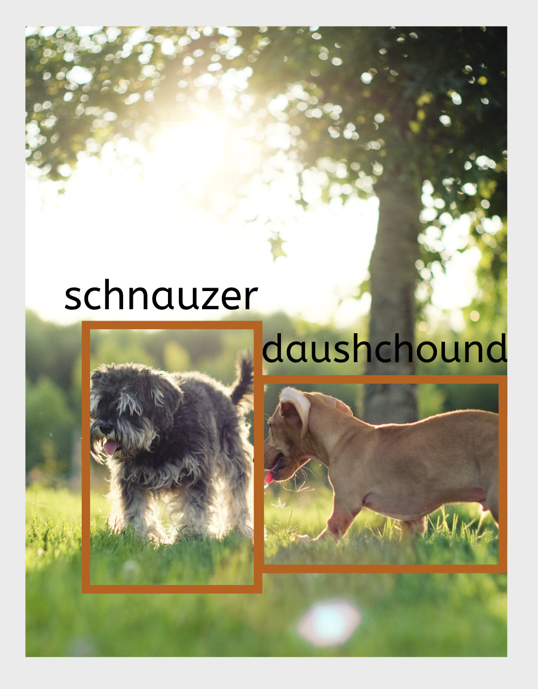
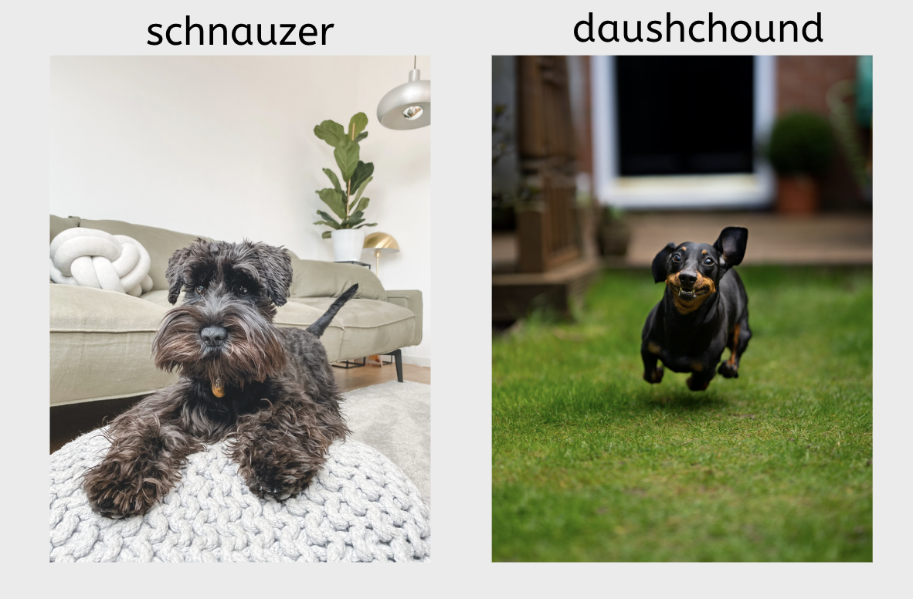

[Course Overview](index.md) \> Practice 2: Images pre-annotation and annotation

# Practice 2: Images pre-annotation and annotation

Framework steps 3 and 4:

Before we apply computer vision methods, available images must be properly prepared. This includes classification of images into correct groups (i.e. fish species), placing boxes or tracing focus objects in the images and augmenting the data set. Image processing is often done manually and can be time consuming. This is particularly true if images for model training are collected through recreational fishing apps, citizen science or automated 'scrubbing' of online sites, as such image collections may include multiple irrelevant images.

## Do you need to annotate your images with bounding boxes or other traced shapes?

There are two broad types of methods used in computer vision based on how features are extracted from images for further use in model training - object detection and image classification.

**Object detection** aims to determine where objects are located in a given image and which category or class each object belongs to (also known as object classification). In other words, after identifying the location of the object in the image, object detection is similar to image classification technique.

**Image classification** is a technique in which the model inputs are usually images of a specific object, such as the dog breeds in the picture below (i.e. one class per image), and the outputs are the predicted classes.

As you can see above there are no bounding boxes in the image classification training data, as the entire image is given a certain category (dog breed, fish species, or other). The model will then look for common features in all images (entire photo) in each defined category. This means that for image classification bounding boxes are not needed, and annotation simply involves grouping images into respective categories, and, for example, placing them into respective folders (as in our example data set). In this course we will use the classification method so strictly speaking we don't need to worry about bounding boxes . However, we still include the step about bounding boxes and object detection method in this course, as course participants might find it useful for other work and also because such pre-processing could help accelerate the process of manual annotation.

## Pre-annotations with standard shapes to remove irrelevant images

Regardless of whether you use object detection or image classification, if you have lots of images from apps, citizen science or other sources, you might want to automatically select only those images that contain the object of your interest, i.e. fish in our case. In this section we will partly automate and speed up image processing tasks by pre-annotating images with bounding boxes to reduce the amount of manual work required to process the images and to place bounding boxes. We will use an object detector from the module *inception_resnet_v2*, a Keras image classification [model](https://arxiv.org/abs/1602.07261) pre-trained on [Open Images Dataset V4](https://storage.googleapis.com/openimages/web/index.html) to detect a fish in the image. The model can be used to detect 600 different shapes, including elephant, lynx, bird, insect, shellfish, tree, plant and others. ***In our example, the pre-trained object detector model will be used to automatically place bounding boxes around the main object in the image but the scripts can be modified to detect specific class names (i.e. from the 600 classes included in the pre-trained model).***

***Astas comment: [the last sentence is still not clear to me and this is not really what I asked. My question is - if we had other shapes in our images, elephants, birds, etc, would the pretrained model have identified them? This is all we need to clarify - i.e. when we run the model will it identify ALL shapes that is was trained for? Then we can mention that people can modify the scripts to identify only the shapes they are interested it]***

Automatic annotation is often not sufficient to prepare our data for model training. In our case the pre-trained model only detects fish, but we then need to group all these images with fishes into species-specific categories or folders. This will require manual annotation, which we will do with the [VGG software](https://www.robots.ox.ac.uk/~vgg/software/via/). There are many other manual annotation software tools, and you can see their comparison in our publication [here](https://www.biorxiv.org/content/10.1101/2022.06.29.498112v1.abstract).

To read our pre-annotated images into the VGG software we will need to transform the metadata somewhat. After placing the bounding box around the fish, we will to convert the bounding boxes coordinates from relative values (provided by the model) to absolute values (needed by VGG) and save the metadata in a *.csv* file. Here we provide a script to do help with this formatting. If you use other annotation packages you might need to transform or convert your metadata in a different way.

 

You can access the notebook here:

 

## VGG software

Now that we prepared the pre-annotated images and read them into the VGG software, the last part of this practice is the manual annotation of images. For that you will need to download the [VGG software](https://www.robots.ox.ac.uk/~vgg/software/via/) and load the images with the *.csv* file generated in the step before (pre-annotations).

 

## Resources

[TensorFlow 2 tutorial: quickstart for beginners](https://www.tensorflow.org/tutorials/quickstart/beginner)
