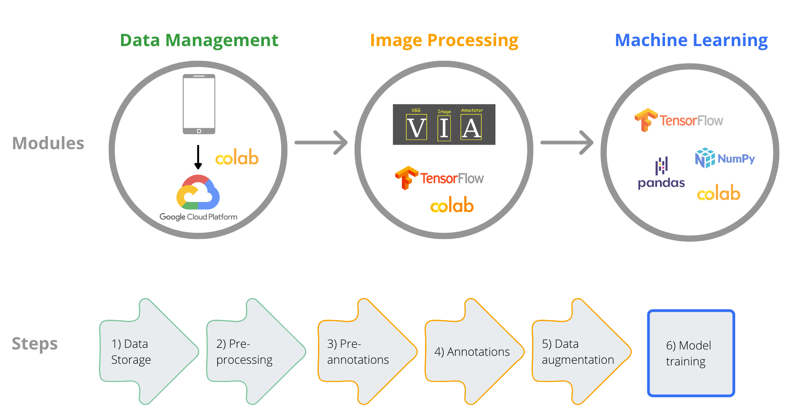

[Course Overview](index.md) > Practice 2: Images pre-annotation and annotation

# Practice 2: Images pre-annotation and annotation 

Framework steps 3 and 4:

In this section we will pre-annotate images to reduce the amount of manual work required. We will use an object detector from the module _inception_resnet_v2_, a Keras image classification [model](https://arxiv.org/abs/1602.07261) pre-trained on [Open Images Dataset V4](https://storage.googleapis.com/openimages/web/index.html) to detect a fish in the image. Note that he pre-trained object detector model was used to automatically place bounding boxes around the fish shapes but the model can be used to detect 600 different shapes, including elephant, lynx, bird, insect, shellfish, tree, plant and others. 

After placing the bounding box in the fish, we will use a script to format the metadata file cointaining the information on the bounding boxes coordinates. We will convert the bounding boxes coordinates from relative values to absolute values and save the metadata in a _.csv_ file. This step is required to open the images and pre-annotations (bounding boxes) in the [VGG software](https://www.robots.ox.ac.uk/~vgg/software/via/), which we will use yo manually annotate images.

You can access the notebook [here]().

 
 

## VGG software

Finally, the last part of this practice is the manual annotation of images.

You will need to download the [VGG software](https://www.robots.ox.ac.uk/~vgg/software/via/) and load the images with the _.csv_ file generated in the step before (pre-annotations).

 

 ## Video

_In preparation_

 

## Resources

[TensorFlow 2 tutorial: quickstart for beginners](https://www.tensorflow.org/tutorials/quickstart/beginner)

