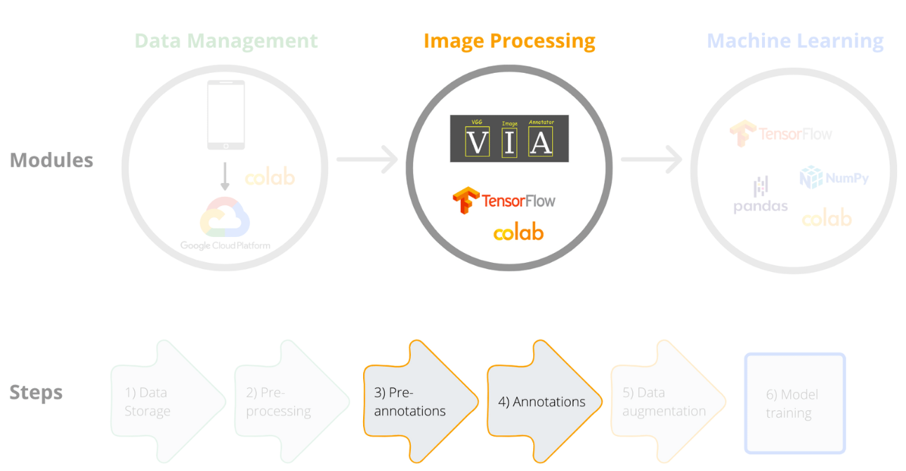

[Course Overview](index.md) \> Practice 2: Images pre-annotation and annotation

# Practice 2: Images pre-annotation and annotation

Framework steps 3 and 4:

Before we apply computer vision methods, available images must be properly prepared. This includes classification of images into correct groups (i.e. fish species), placing boxes or tracing focus objects in the images and augmenting the data set. Image processing is often done manually and can be time consuming. This is particularly true if images for model training are collected through recreational fishing apps, citizen science or automated 'scrubbing' of online sites, as such image collections may include multiple irrelevant images.

## Do you need to annotate your images with bounding boxes or other traced shapes? 

There are two types of methods to label the dataset (i.e. methods used in supervised machine learning) that will be used for trainnig models - object detection and image classification.

**Object detection** 

***Add an picture of some sorts to make the page look nicer***

Note that this step is required only if you are using the object detection method for model training. In this course we will use the classification method which means we will not need the *.csv* file with annotations.

## Pre-annotations with standard shapes to remove irrelevant images 

Regardless of whether you use object detection or image classification, if you have lots of images from apps, citizen science or other sources, you might want to automatically select only those images that contain the object of your interest, i.e. fish in our case. In this section we will partly automate and speed up image processing tasks by pre-annotating images with bounding boxes to reduce the amount of manual work required to process the images and to place bounding boxes. We will use an object detector from the module *inception_resnet_v2*, a Keras image classification [model](https://arxiv.org/abs/1602.07261) pre-trained on [Open Images Dataset V4](https://storage.googleapis.com/openimages/web/index.html) to detect a fish in the image. In our example, that the pre-trained object detector model will be used to automatically place bounding boxes around the fish shapes, but the model can be used to detect 600 different shapes, including elephant, lynx, bird, insect, shellfish, tree, plant and others. **Catarina, how would you ask the model to detect other shapes? Would it just do it automatically if, say, a bird was in the image? It might be worth mentioning it**

Automatic annotation is often not sufficient to prepare our data for model training. In our case the pre-trained model only detects fish, but we need to group all these images with fishes into species-specific categories or folders. This will require manual annotation, which we will do with the [VGG software](https://www.robots.ox.ac.uk/~vgg/software/via/). There are many other manual annotation software tools, and you can see their comparison in our publication **here. [link to the publication].**

To read our pre-annotated images into the VGG software we will need to transform the metadata somewhat. After placing the bounding box around the fish, we will to convert the bounding boxes coordinates from relative values (provided by the model) to absolute values (needed by VGG) and save the metadata in a *.csv* file. Here we provide a script to do help with this formatting. If you use other annotation packages you might need to transform or convert your metadata in a different way.

 

You can access the notebook here:

 

## VGG software

Now that we prepared the pre-annotated images and read them into the VGG software, the last part of this practice is the manual annotation of images. For that you will need to download the [VGG software](https://www.robots.ox.ac.uk/~vgg/software/via/) and load the images with the *.csv* file generated in the step before (pre-annotations).

 

## Resources

[TensorFlow 2 tutorial: quickstart for beginners](https://www.tensorflow.org/tutorials/quickstart/beginner)
