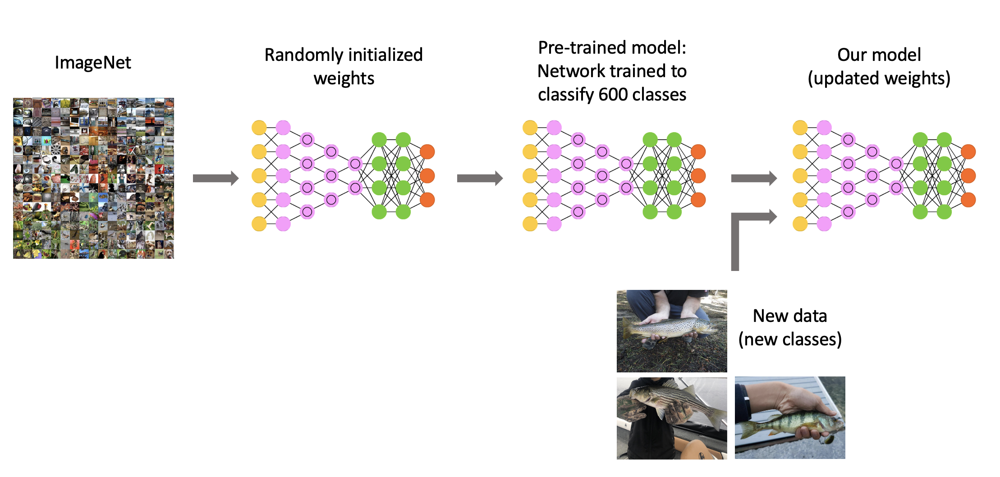

[Course Overview](index.md) > Practice 4: Model training

# Practice 4: Model training

Framework step 6:

 

For this practice you need to be familiear with a few concepts that we have not introduced yet.

**Transfer learning** is commonly defined as a research problem in machine learning that focuses on storing knowledge gained while solving one problem and applying it to a different but related problem. For example, the knowledge gained while learning to recognize fishes could apply when trying to recognize clownfish. 

From a practical point of view, transferring information from a previously learned task (previously trained model) for the learning of new tasks (new models) has the potential to significantly improve efficiency of the learning process.

 

 

You can access the notebook of this practice here:

 

## Resources

