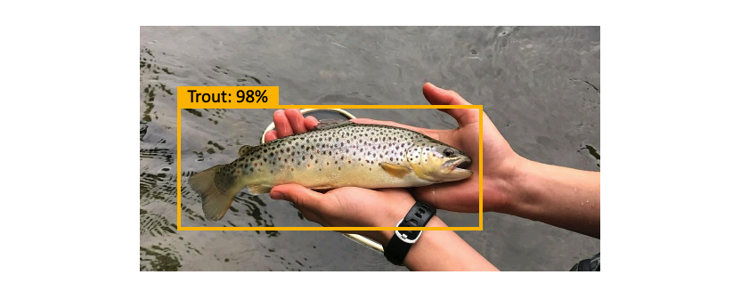
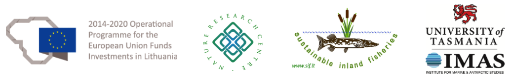

<h1 style="text-align:center;">Machine learning based image collection, annotation and classification</h1>

In this online course you will learn about:

1. concepts of data science, machine learning (ML), computer vision, deep learning and Convolutional Neural Networks (CNNs)
2. how to pre-process and pre-annotate images to accelerate your ML projects 
3. how to apply data augmentation techniques 
4. how to build an image classification model with your own or example data
  

The online course will be organised as a series of recorded lectures and exercises using Python, combined with live Q&A sessions.

The course is led by [Catarina Silva](https://catarinasilva.weebly.com/) (Nature Research Centre, Lithuania) and [Asta Audzijonyte](https://astaaudzi.com/) (Nature Research Centre, Lithuania & University of Tasmania, Australia). 

Participation is free. If you would like to participate, please register [here](https://forms.gle/kpPaXWFBVZ1fApob6).

This course is using the framework described in this [publication](https://www.biorxiv.org/content/10.1101/2022.06.29.498112v1.abstract).

 

## Course overview

A. [Introduction](A-introduction.md)

B. [Concepts of machine learning and computer vision](B-ML-concepts.md)

C. [Intro Practice: Basics of computer vision with Python](C-intro-practice.md)

D. [Practice 1: Pre-processing images](D-practice-1.md)

E. [Practice 2: Images pre-annotation and annotation](E-practice-2.md)

F. [Practice 3: Data augmentation](F-practice-3.md)

G. [Practice 4: Model training](G-practice-4.md)

H. Ideas for the future (will be released after the course)

 

## Programming skills and Python

It will be useful if course participants have basic programming experience, in Python or R. The scripts used in the course are written in Python, but they are adapted to be user friendly and do not require prior Python knowledge to run them (you would naturally need Python knowledge to modify these scripts further). If you want to learn more about coding with Python a few useful tutorials of basic operations can be found [here](https://www.learnpython.org/). You can also find a list of books [here](https://wiki.python.org/moin/IntroductoryBooks).

 

## Bring your own images

We will provide an example dataset for the course. This dataset includes 50 images per species which were provided by [MyCatch](https://mycatch.ca/) and [Fishial](https://fishial.ai/).
It would be very interesting and exciting if course participants also bring their own datasets of fish images. We would need a minimum of 50 images per species and you can use as few as 2 species to start with (however, if species are very similar morphologically, we might need more than 50 images per species). Of course, you want to make sure that fish species in your dataset are identified correctly, otherwise your model will not be very useful (you might have heard the expression "garbage in - garbage out"). Finally, for the tutorials we will use Google drive so please upload your own images to your Google drive by species (i.e. one species per folder). 

 

## Online meetings

In this course, it is expected that participants will mostly learn independently, but we will have three online meetings to go through the materials, ask questions and for general discussion. 

These meetings will be recorded and videos will be available immediately after the meeting.

| Date  | Time (GMT+1) | Programme |
| ------------- | ------------- |----|
| 25 Oct, 2022  | 09:00  | Welcome and introductions, overview of modules A-D, Q&As|
| 26 Oct, 2022  | 12:00  | Q&As, overview of modules E-F
| 27 Oct, 2022  | 15:00  | Q&As, overview of module G, presentation of trained models and future directions

 

This course is organised as a part of the [“Sustainable inland fisheries”](https://en.sif.lt/home%20--%20EN/) project, funded by the European Regional Development Fund (project No 01.2.2-LMT-K-718-02-0006) under grant agreement with the Research Council of Lithuania (LMTLT).

 

Pew Fellows Program in Marine Conservation at

<b>
The Pew Charitable Trusts
</b>

 
 